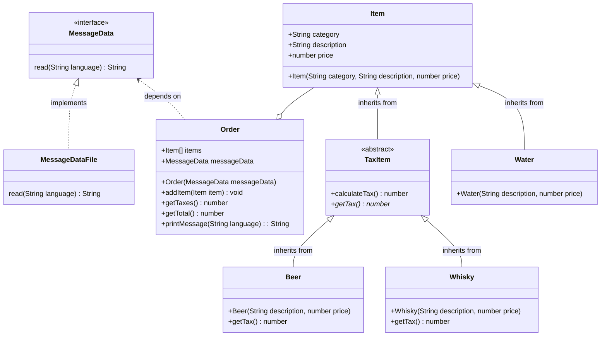

# Solid with Typescript
This project is a simple POC using e-commerce as a base (with Order and Item classes) and applying SOLID concepts over it. How it's just a study project to improve my SOLID knowledge, there isn't a server, framework or console as entrypoint to run it, there's only tests with Jest to validade the business logic and ensure that the 5 principles are being correctly applied.

# Table of Contents
1. [Requirements](#requirements)
2. [Features](#features)
3. [Class Diagram](#class-diagram)
4. [How to Run?](#how-to-run)
    4.1 [Using Docker](#using-docker)
    4.2 [In Your Local Machine](#in-your-local-machine)
5. [SOLID Principles](#solid)
    5.1 [Single Responsibility Principle (SRP)](#single-responsibility-principle-srp)
    5.2 [Open-Closed Principle (OCP)](#open-closed-principle-ocp)
    5.3 [Liskov Substitution Principle (LSP)](#liskov-substitution-principle-lsp)
    5.4 [Interface Segregation Principle (ISP)](#interface-segregation-principle-isp)
    5.5 [Dependency Inversion Principle (DIP)](#dependency-inversion-principle-dip)
6. [Made With](#made-with)
7. [Author](#author)

## 📝 Requirements

- [Docker](https://www.docker.com/get-started/)
- [NodeJs](https://nodejs.org/en/download/current)

## 💡 Features
It's a quite simple domain, here you'll have an Order, that may have multiple Items. These items may be of different types, such as Beer, Water or Whisky. The Order class have some features, such as get total of taxes or the total amount bought by the customers. See the class diagram below for more details:



## 🚀 How to Run?

You have 2 options to run this project, as it has no common entrypoint such as HTTP endpoint or a index file, you'll need to run the tests.

### 🐋 Using Docker:
Simply run:
```bash
docker compose up
```
The docker console will be attached to your terminal, in case you wanna access the bash to run some command (or erase the node_modules or dist folders).

### 👨🏻‍💻 In your local machine:
Run the command bellow, the tests will be attached to your terminal for you to have a real time feedback about the success of the tests:
```bash
npm test
```

## SOLID
### What is SOLID and why apply these principles?
SOLID is an mnemonic acronym for 5 principles to be implemented in a software in order to make it more maintainable, reusable, flexible and understandable.

### SRP - Single Responsability Principle
The goal of this principle is to separate things that changes for different reasons. The example below show us the `Order` and `Item` classes that may be improved by applying this principle:
````ts
import Item from './Item';

export default class Order {
  items: Item[];

  constructor() {
    this.items = [];
  }

  getTaxes() {
    let taxes = 0;
    for ( const item of this.items) {
      if (item.category === 'Beer') {
        taxes += (item.price * 10) / 100;
      }
      if (item.category === 'Whisky') {
        taxes += (item.price * 20) / 100;
      }
    }
    return taxes;
  }
}

export default class Item {
  category: string;
  description: string;
  price: number;

  constructor(category: string, description: string, price: number) {
    this.category = category;
    this.description = description;
    this.price = price;
  }
}
````

What can be improved in the classes above? First of all, we need to discover which part can change for different reasons, in this case is the method `getTaxes()` in the `Order` class, we have 2 if statements in there that don't seens to belong to `Order` class, but to `Item` class, because it's handling item's objects. See below how the if statements were moved to `Item` class:
````ts
import Item from './Item';

export default class Order {
  items: Item[];
  constructor() {
    this.items = [];
  }

  getTaxes() {
    let taxes = 0;
    for ( const item of this.items) {
      taxes += item.calculateTax();
    }
    return taxes;
  }
}

export default class Item {
  category: string;
  description: string;
  price: number;

  constructor(category: string, description: string, price: number) {
    this.category = category;
    this.description = description;
    this.price = price;
  }

  calculateTax() {
      if (this.category === 'Beer') {
        return (this.price * 10) / 100;
      }
      if (this.category === 'Whisky') {
        return (this.price * 20) / 100;
      }
      return 0;
  }
}
````

To apply the SRP, was created the `calculateTax()` method in `Item`, being responsible to handle different calculations for different categories. In `Order` class was simply called the method `calculateTax()` by using the instance of `Item`.

### OCP - Open-Closed Principle
In Open-Closed Principle, we should be closed for modification and open for extension, but what does it means? It means that the source code of a class should not be changed directly and the part that changes the most, keeps protected from the part that changes all the time. Let's see and example of code that needs the OCP:
```ts
Item class:
export default class Item {
  category: string;
  description: string;
  price: number;

  constructor(category: string, description: string, price: number) {
    this.category = category;
    this.description = description;
    this.price = price;
  }

  calculateTax() {
      if (this.category === 'Beer') {
        return (this.price * 10) / 100;
      }
      if (this.category === 'Whisky') {
        return (this.price * 20) / 100;
      }
      return 0;
  }
}
```
Going back to our `Item` class, we can see the method `calculateTax()` can change frequently, what if we need to create one more category? Should we simply add one more if statement? OF COURSE NOT!!! It would fill the Item class with a lot of crap. So how to prevent this from happening? By creating subclasses for each category and transforming the `Item` class into an abstract class, for example:
```ts
export default abstract class Item {
  category: string;
  description: string;
  price: number;

  constructor(category: string, description: string, price: number) {
    this.category = category;
    this.description = description;
    this.price = price;
  }

  calculateTax() {
      return (this.price * this.getTax()) / 100;
  }

  abstract getTax(): number;
}

import Item from './Item';

export default class Beer extends Item {
  constructor(description: string, price: number) {
    super('Beer', description, price);
  }

  getTax() {
      return 10;
  }
}

import Item from './Item';

export default class Whisky extends Item {
  constructor(description: string, price: number) {
    super('Whysky', description, price);
  }

  getTax() {
      return 20;
  }
}

import Item from './Item';

export default class Water extends Item {
  constructor(description: string, price: number) {
    super('Water', description, price);
  }

  getTax() {
      return 0;
  }
}
```
As we can see, we now have a new category called `Water`, and by applying the OCP, we'd achieved a class open to extension and closed for modification, now always we need to create a new category of item, we can create a new subclass of `Item` class and implements the method `getTax()` responsible to store the tax and specific details of implementation instead of having multiple if statements in `Item` class.


### LSP - Liskov Substitution Principle
This principle states that: "If S (classes `Beer`, `Whisky` and `Water`) is subclass of T (`Item` class), in a program, it may be possible to replace instances of T (`Item`) by instances of S (classes `Beer`, `Whisky` and `Water`), WITHOUT BREAKING PROGRAM WORKING". With this said, what is necessary to achieve LSP?
- Pre-Conditions cannot be strengthened
- Post-Conditions cannot be weakened
- Invariantes should be consistents

When we say that "Pre-Conditions cannot be strengthened", it means ceasing to accept input that the superclass considers valid, for example in the class `Employee`, the method `setAge()` is preventing the parent class `Person` to validate a rule that is correct, therefore, hurting LSP:

```ts
export default class Person {
    age: number;

    constructor () {
        this.age = 0;
    }

    setAge(age: number) {
        if (age < 0) throw new Error("Idade inválida, a idade deve ser maior que zero");
        this.age = age;
    }
}

import Person from "./Person";

export default class Employee extends Person {

    setAge(age: number) {
        if (age < 18) throw new Error("A pessoa deve ser maior de 18 anos");
        super.setAge(age);
    }
}
```

Already when we say that "Post-Conditions cannot be weakened", it means accepting wider output, in another words, leaving the outputs different from the expectations of whoever is calling the method, for example, a method awaits a type of return, but gets an exception from a method that should return a value instead throwing an exception, as shown below:
```ts
import Item from './Item';

export default class Order {
  items: Item[];
  constructor() {
    this.items = [];
  }

  getTaxes() {
    let taxes = 0;
    for ( const item of this.items) {
      // SHOULD RETURN A NUMBER
      taxes += item.calculateTax();
    }
    return taxes;
  }
}

import Item from './Item';

export default class Water extends Item {
  constructor(description: string, price: number) {
    super('Water', description, price);
  }

  getTax() {
    // instead of returning a number, it throws an exception
    throw new Error('Water is tax free');
  }
}
```

When we say that "Invariants should keep consistents", is when a subclass allows the conceptual state of the class hierarchy to become invalid.

### ISP - Interface Segregation Principle
The ISP is achieved by creating new interfaces/classes/abstract classes, move its methods to it and extends to subclasses, only this subclasses will extends the methods that they need, preventing a class to implement unnecessary methods. Example before the ISP:
```ts
export default abstract class Item {
  category: string;
  description: string;
  price: number;

  constructor(category: string, description: string, price: number) {
    this.category = category;
    this.description = description;
    this.price = price;
  }

  calculateTax() {
      return (this.price * this.getTax()) / 100;
  }

  abstract getTax(): number;
}

export default class Beer extends Item {
  constructor(description: string, price: number) {
    super('Beer', description, price);
  }

  getTax() {
      return 10;
  }
}

export default class Whisky extends Item {
  constructor(description: string, price: number) {
    super('Whisky', description, price);
  }

  getTax() {
      return 20;
  }
}

export default class Water extends Item {
  constructor(description: string, price: number) {
    super('Water', description, price);
  }

  getTax() {
    throw new Error('Water is tax free');
  }
}

export default class Order {
  items: Item[];
  constructor() {
    this.items = [];
  }

  getTaxes() {
    let taxes = 0;
    for ( const item of this.items) {
      taxes += item.calculateTax();
    }
    return taxes;
  }
}

```
See how the `Water` class implements a method that is not necessary and how the method `getTaxes()` in `Order` call for all instances of `Item`, which includes the `Water` that throws an exception in a mehod that shouldn't be there, now take a look at how to implement ISP:

```ts
export default abstract class Item {
  category: string;
  description: string;
  price: number;

  constructor(category: string, description: string, price: number) {
    this.category = category;
    this.description = description;
    this.price = price;
  }
}

export default abstract class TaxItem extends Item {

  calculateTax() {
      return (this.price * this.getTax()) / 100;
  }

  abstract getTax(): number;
}

export default class Beer extends TaxItem {
  constructor(description: string, price: number) {
    super('Beer', description, price);
  }

  getTax() {
      return 10;
  }
}

export default class Whisky extends TaxItem {
  constructor(description: string, price: number) {
    super('Whisky', description, price);
  }

  getTax() {
      return 20;
  }
}

export default class Water extends Item {
  constructor(description: string, price: number) {
    super('Water', description, price);
  }
}

export default class Order {
  items: Item[];
  constructor() {
    this.items = [];
  }

  getTaxes() {
    let taxes = 0;
    for ( const item of this.items) {
      if (item instanceof TaxItem) {
        taxes += item.calculateTax();
      }
    }
    return taxes;
  }
}
```
As we can se above, was created an intermediary class called `TaxItem` that extends from `Item`, now only the necessary classes extends from `TaxItem` (`Beer` and `Whisky` classes) and others directly from `Item` (`Water` class). In `Order` method, a validation is made in `getTaxes()` method that checks whether or not a class is instance of `TaxItem`, ensuring that only the necessary items will calculate taxes.


### DIP - Dependency Inversion Principle
This principle aims to implements modules that depends on abstractions, whether high or low-level module. The `Order` class below is using a low level module from node that reads file, it should not happen because makes the class depends on a low level module:

```ts
export default class Order {
  items: Item[];
  constructor() {
    this.items = [];
  }

  async printMessage(language: string) {
    let message = await fs.readFile(`./messages/${language}.txt`, 'utf-8');
    return message
      .replace('{total}', this.getTotal()+"")
      .replace('{taxes}', this.getTaxes()+"");
  }
}
```
To fix this, we can create an interface called `MessageData` and use it in the constructor of `Order` class, also, we need to implement this interface in a concrete class as we can se in `MessageDataFile` class, and finally, we call the instance of `MessageData` inside the method `printMessage()`:
```ts
export default class Order {
  items: Item[];
  messageData: MessageData;

  constructor(messageData: MessageData) {
    this.items = [];
    this.messageData = messageData;
  }

  async printMessage(language: string) {
    const message = await this.messageData.read(language);
    return message
      .replace('{total}', this.getTotal()+"")
      .replace('{taxes}', this.getTaxes()+"");
  }
}

export default interface MessageData {
  read(language: string): Promise<string>;
}

export default class MessageDataFile implements MessageData {
  async read(language: string): Promise<string> {
    return fs.readFile(`./messages/${language}.txt`, 'utf-8')
  }
}

```
Remember: You'll inject `MessageDataFile` class to `Order` from a test file, controller, service class, etc...
## ⚙️ Made With:

- TypeScript 5.3.3
- NodeJS 18.18.2
- Jest 29.7.0
- Docker 24.0.7
- Docker Compose 1.29.2

## 🧑🏻‍💻 Author

_Matheus Oliveira da Silva_ - [Github](https://github.com/matheusolivesilva) | [Linkedin](https://www.linkedin.com/in/matheusoliveirasilva/)
